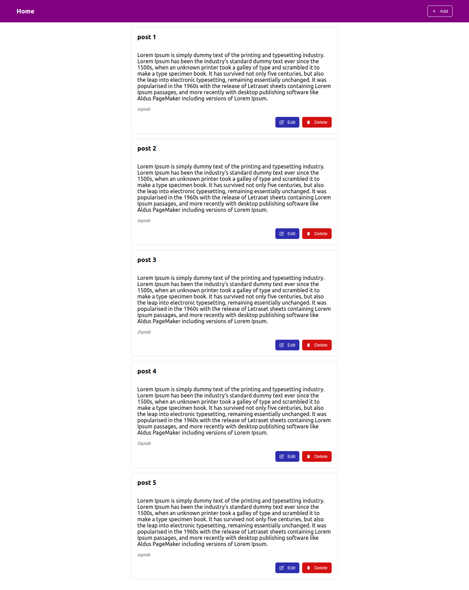
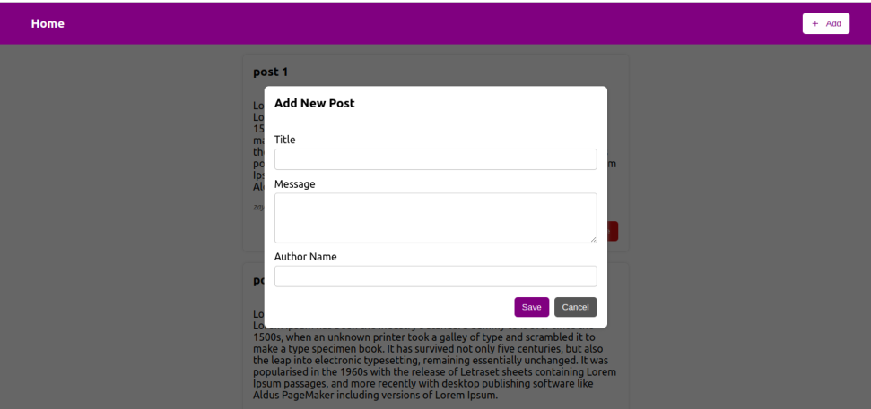
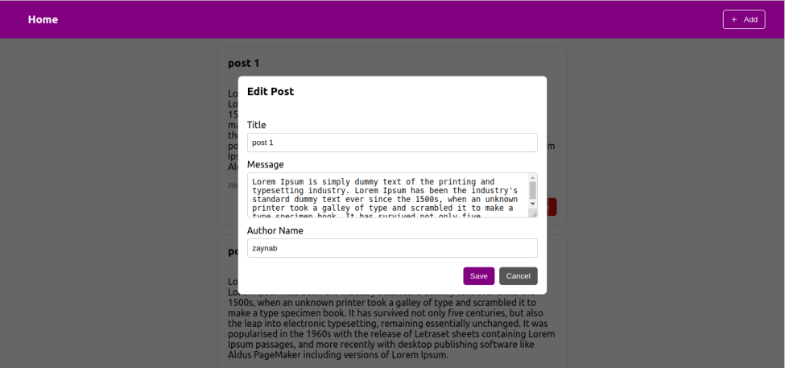
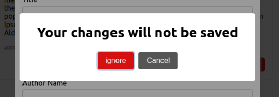
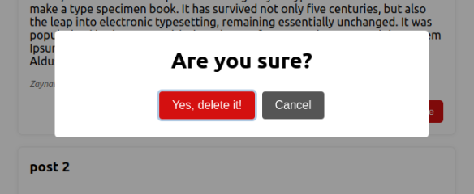

## Full Stack Development Project for ModularCX.

## Project Description:

This project is a simple web application for managing blog posts, it is based on CRUD operations where we can create, read, update and delete posts.

## Used Languages/Library

The project is built based on MERN stack (React js, Node js, Express js, MongoDB)

## Setup the Project

- Pull the project

```cli
git clone https://github.com/zaynab-abdelnabi/ModularCX-task.git
```

- Install the dependencies inside the frontend and backend folders by

```cli
npm install
```

This command will read the package.json file and install all the required dependencies, such as, `express`, `mongoose`, and `react`

- Rename `.env.example` file to `.env` and add the required information for connecting to mongoDB inside it

- Run the backend first

```cli
npm install
```

and make sure it's running on port `localhost:3000` and successfully connected to the database.

- Run the frontend

```cli
npm install
```

## CRUD Documentation

### Get list of all posts

No body required. Will return list of all posts.

**GET** `http://localhost:3000/posts`

Sample **Response**:

```json
{
  "success": true,
  "message": "Get all posts successfully",
  "response": [
    {
      "_id": "62d8fd0964c89797ae2db962",
      "title": "post 1",
      "message": "Lorem Ipsum is simply dummy text of the printing and typesetting industry. Lorem Ipsum has been the industry's standard dummy text ever since the 1500s, when an unknown printer took a galley of type and scrambled it to make a type specimen book. It has survived not only five centuries, but also the leap into electronic typesetting, remaining essentially unchanged. It was popularised in the 1960s with the release of Letraset sheets containing Lorem Ipsum passages, and more recently with desktop publishing software like Aldus PageMaker including versions of Lorem Ipsum.",
      "author_name": "zaynab",
      "__v": 0
    },
    {
      "_id": "62d8fd0a64c89797ae2db964",
      "title": "post 2",
      "message": "Lorem Ipsum is simply dummy text of the printing and typesetting industry. Lorem Ipsum has been the industry's standard dummy text ever since the 1500s, when an unknown printer took a galley of type and scrambled it to make a type specimen book. It has survived not only five centuries, but also the leap into electronic typesetting, remaining essentially unchanged. It was popularised in the 1960s with the release of Letraset sheets containing Lorem Ipsum passages, and more recently with desktop publishing software like Aldus PageMaker including versions of Lorem Ipsum.",
      "author_name": "zaynab",
      "__v": 0
    },
    {
      "_id": "62dbc6f185b4a22d29190bc6",
      "title": "post 3",
      "message": "Lorem Ipsum is simply dummy text of the printing and typesetting industry. Lorem Ipsum has been the industry's standard dummy text ever since the 1500s, when an unknown printer took a galley of type and scrambled it to make a type specimen book. It has survived not only five centuries, but also the leap into electronic typesetting, remaining essentially unchanged. It was popularised in the 1960s with the release of Letraset sheets containing Lorem Ipsum passages, and more recently with desktop publishing software like Aldus PageMaker including versions of Lorem Ipsum.",
      "author_name": "Zaynab",
      "__v": 0
    },
    {
      "_id": "62dbcf3385b4a22d29190bcd",
      "title": "post 4",
      "message": "Lorem Ipsum is simply dummy text of the printing and typesetting industry. Lorem Ipsum has been the industry's standard dummy text ever since the 1500s, when an unknown printer took a galley of type and scrambled it to make a type specimen book. It has survived not only five centuries, but also the leap into electronic typesetting, remaining essentially unchanged. It was popularised in the 1960s with the release of Letraset sheets containing Lorem Ipsum passages, and more recently with desktop publishing software like Aldus PageMaker including versions of Lorem Ipsum.",
      "author_name": "Zaynab",
      "__v": 0
    }
  ]
}
```

### Get a specific post

No Body required. Will get details of specific post

**GET** `http://localhost:3000/posts/:id`

Sample **response**:

```json
{
  "success": true,
  "message": "Get post by Id successfully",
  "response": {
    "_id": "62d8fd0964c89797ae2db962",
    "title": "post 1",
    "message": "Lorem Ipsum is simply dummy text of the printing and typesetting industry. Lorem Ipsum has been the industry's standard dummy text ever since the 1500s, when an unknown printer took a galley of type and scrambled it to make a type specimen book. It has survived not only five centuries, but also the leap into electronic typesetting, remaining essentially unchanged. It was popularised in the 1960s with the release of Letraset sheets containing Lorem Ipsum passages, and more recently with desktop publishing software like Aldus PageMaker including versions of Lorem Ipsum.",
    "author_name": "zaynab",
    "__v": 0
  }
}
```

### Add a new post

Body must be JSON. Adds a new post.

Sample **body**:

```json
{
  "title": "Post 1",
  "message": "message 1",
  "author_name": "Zaynab Abd El Nabi"
}
```

**POST** `http://localhost:3000/posts`

**Response** will have the same data, plus an \_id property.

```json
{
  "success": true,
  "message": "New post successfully created",
  "response": {
    "title": "Post 1",
    "message": "message 1",
    "author_name": "Zaynab Abd El Nabi",
    "_id": "62dc073ecc116324fd56abed",
    "__v": 0
  }
}
```

#### Error handling

**Missing field**

```json
{
  "success": false,
  "message": "Post validation failed: author_name: Path `author_name` is required."
}
```

### Edit an existing post

Body must be JSON. Edit an existing post. with the id of the post we want to edit.

Sample **body**:

```json
{
  "title": "updated post"
}
```

**PUT** `http://localhost:3000/posts/:id`

**Response** will get data for the edition

```json
{
  "success": true,
  "message": "Post updated successfully",
  "response": {
    "_id": "62dc073ecc116324fd56abed",
    "title": "updated post",
    "message": "message 1",
    "author_name": "Zaynab Abd El Nabi",
    "__v": 0
  }
}
```

### Delete a post

No body required. post id will come from the URL.

**DELETE** `http://localhost:3000/posts/:id`

**Response** for the delete will just be the id for the deleted post

```json
{
  "success": true,
  "message": "Post deleted successfully",
  "response": {
    "_id": "62dc073ecc116324fd56abed",
    "title": "updated post",
    "message": "message 1",
    "author_name": "Zaynab Abd El Nabi",
    "__v": 0
  }
}
```

### Error handling

**Invalid Id**

```json
{
  "success": false,
  "message": "id '62d7c7f26386f5' is invalid"
}
```

**Not found Id**

```json
{
  "success": false,
  "message": "Post is not found"
}
```

Enjoy Testing :heart:

## Frontend Documentation

### Home Page



### Add new post form



### Edit an existing post form



### Alerts

#### On cancel and exit the form



#### On delete a post


